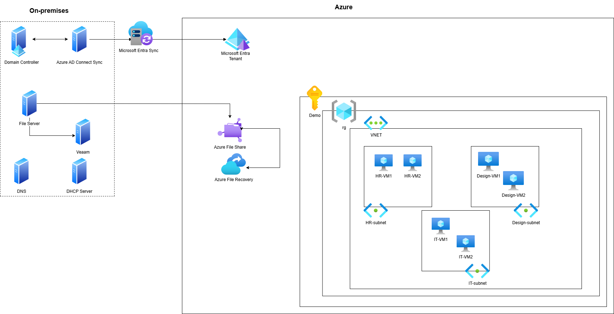
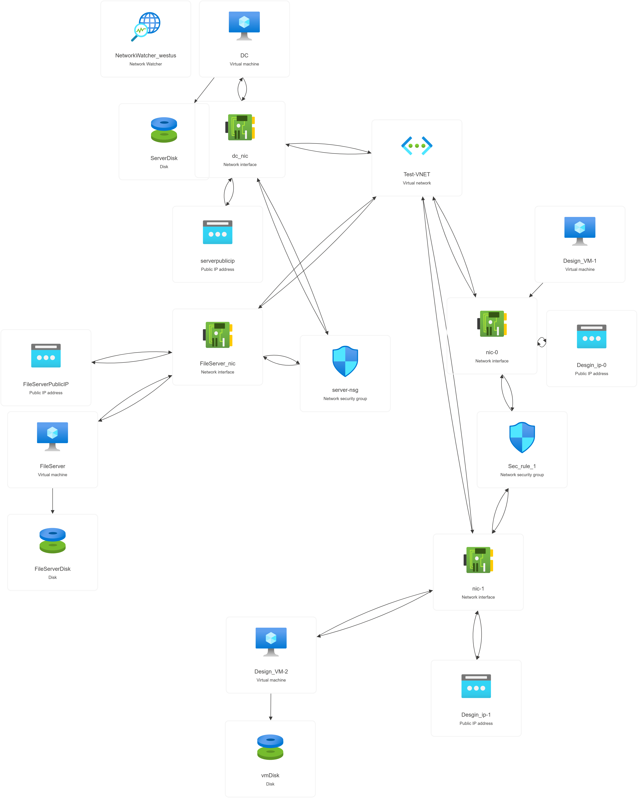

## Project Conclusion

This project demonstrates the end-to-end design and automated deployment of a small organization's hybrid IT infrastructure using Azure and Terraform. The environment replicates a typical on-premises setup, including Active Directory, file servers, group policies, and departmental segmentation, and extends it to the cloud for scalability and resilience.

Key achievements include:
- Automated provisioning of core Azure resources: resource groups, virtual networks, subnets, and Windows servers.
- Secure and efficient Active Directory setup, including domain controller deployment and bulk user/group management via PowerShell.
- Segmentation of departments (IT, HR, Design) into separate subnets, with controlled communication enabled through VNet peering.
- Implementation of a file server with network drives, NTFS permissions, and group-based access control.
- Integration of backup and recovery solutions (e.g., Veeam, Azure File Recovery).
- Use of Infrastructure as Code (Terraform) for repeatable, scalable, and auditable deployments.
- Documentation of troubleshooting steps, best practices, and automation scripts for domain join and server configuration.

The following architecture diagrams summarize the on-premises and Azure infrastructure, showing connectivity, resource layout, and security boundaries:





<!-- Add all PNG and JPG images in the docs folder -->


 


This foundation supports further automation and configuration management (e.g., with Ansible), enabling robust, secure, and easily managed IT environments for future growth and operational efficiency.

## Prerequisites for this project

  ### Hardware:
    - 1-2 Servers; 
        This could be Raspbery pi, old laptop, or Mini PCs

  ### Software:
  - OS: Microsoft Windows server 2016 datacenter


  - 30-day free Veeam licence Key 

  - OpenVPN (https://openvpn.net/connect-docs/connect-for-windows.html)


### How to providioning Entra ID agent on-prem:
 - Sign in to the Microsoft Entra admin center as at least a Hybrid Identity Administrator.
 - In the Azure portal, select Microsoft Entra ID.
 - On the left pane, select Microsoft Entra Connect, and then select Cloud Sync.
 - After you download the Microsoft Entra Connect Provisioning Agent Package, run the AADConnectProvisioningAgentSetup.exe installation file from your downloads folder.
 - Browse to Entra ID > Password reset > On-premises integration.
 - Check the option for Enable password write back for synced users .
 - (optional) If Microsoft Entra Connect provisioning agents are detected, you can additionally check the option for Write back passwords with Microsoft Entra Cloud Sync.
 - Check the option for Allow users to unlock accounts without resetting their password to Yes.
 - When ready, select Save.

 ## Cloud Infrastructure

  ###  How to install Azure CLI

  1. Go to the official Azure CLI installation page: https://learn.microsoft.com/en-us/cli/azure/install-azure-cli
  2. For Windows, download and run the installer (`AzureCLI.msi`).
  3. Follow the prompts to complete the installation.
  4. After installation, open a new Command Prompt or PowerShell window.
  5. Verify the installation by running:
     ```
     az --version
     ```
  6. To sign in to your Azure account, run:
     ```
     az login
     ```

  ### How to install Terraform

  1. Go to the official Terraform download page: https://developer.hashicorp.com/terraform/downloads
  2. Download the appropriate package for your operating system (e.g., Windows 64-bit).
  3. Extract the downloaded ZIP file to a folder (e.g., `C:\terraform`).
  4. Add the folder path (e.g., `C:\terraform`) to your system's PATH environment variable:
     - Open Control Panel → System → Advanced system settings → Environment Variables.
     - Under "System variables", find and select `Path`, then click Edit.
     - Add the path to the folder where you extracted `terraform.exe`.
     - Click OK to save.
  5. Open a new Command Prompt or PowerShell window.
  6. Verify the installation by running:
     ```
     terraform -version
     ```

  ### How to install Veeam Backup and Replication

  1. Go to the official Veeam download page: https://www.veeam.com/downloads.html
  2. Select the free trial for Veeam Backup & Replication.
  3. Fill out the required information and submit the form.
  4. Check your email for the download link and license key.
  5. Download and run the installer on your Windows server.
  6. Follow the prompts to complete the installation.
  7. When prompted, enter your license key.
  8. After installation, open Veeam Backup & Replication from the Start menu.

  ### How to install OpenVPN

  1. Go to the official OpenVPN download page: https://openvpn.net/community-downloads/
  2. Download the Windows installer under the "Windows" section.
  3. Run the installer and follow the prompts to complete the installation.
  4. After installation, download the configuration files from your VPN provider or network administrator.
  5. Import the configuration files into the OpenVPN client.
  6. Connect to the VPN by selecting the desired configuration and clicking "Connect".

  ### Network configuration for on-premises servers

  - Assign static IP addresses to the on-premises servers.
  - Configure the subnet mask, default gateway, and DNS servers.
  - Ensure the servers can communicate with the domain controller and other critical resources.
  - Enable Remote Desktop for management access.
  - Configure firewall rules to allow necessary traffic (e.g., RDP, SMB, VPN).

  ### Active Directory configuration

  - Install the Active Directory Domain Services (AD DS) role on the designated server.
  - Promote the server to a domain controller, following the wizard prompts.
  - Configure the domain name, forest functional level, and other settings as required.
  - Create organizational units (OUs) for departments (e.g., IT, HR, Design).
  - Create and manage user accounts, groups, and computers within the OUs.
  - Implement group policies to enforce security and configuration settings.

  ### File server configuration

  - Install the File and Storage Services role on the designated server.
  - Create shared folders for departmental file storage.
  - Configure NTFS permissions and share permissions based on user roles and groups.
  - Enable versioning and recycle bin features for data recovery.
  - Schedule regular backups of the file server data.

  ### Backup and recovery configuration

  - Install the Veeam Backup & Replication console on the designated server.
  - Add the VMware or Hyper-V hosts to the Veeam console for backup management.
  - Create backup jobs for virtual machines, specifying the backup destination and schedule.
  - Configure retention policies and backup copy jobs as needed.
  - Test the backup and recovery process to ensure data protection.

  ### Monitoring and maintenance

  - Regularly check the backup job status and resolve any issues.
  - Monitor the performance and availability of critical services (e.g., Active Directory, file server).
  - Review and update documentation for network diagrams, server configurations, and procedures.
  - Perform routine maintenance tasks, such as applying updates, patching, and hardware checks.

  ### Security best practices

  - Use strong, unique passwords for all accounts, especially administrative accounts.
  - Implement multi-factor authentication (MFA) for added security.
  - Regularly review and update firewall rules, network security groups, and access controls.
  - Keep software and firmware up to date with the latest security patches.
  - Educate users about security risks and safe computing practices.

  ### Troubleshooting common issues

  - If a server fails to join the domain, check the network connectivity, DNS settings, and firewall rules.
  - If users cannot access shared folders, verify the NTFS permissions, share permissions, and network connectivity.
  - If backup jobs fail, check the Veeam logs, verify the backup destination, and ensure sufficient storage space.
  - If there are performance issues, check the resource utilization (CPU, memory, disk) and network latency.

  ### Additional resources

  - Microsoft Learn: Azure Fundamentals
  - Microsoft Learn: Terraform for Azure
  - Veeam Documentation
  - OpenVPN Documentation
  - Active Directory Documentation
  - File Server Documentation
  - Backup and Recovery Documentation
  - Monitoring and Maintenance Documentation
  - Security Best Practices Documentation
  - Troubleshooting Guide Documentation


